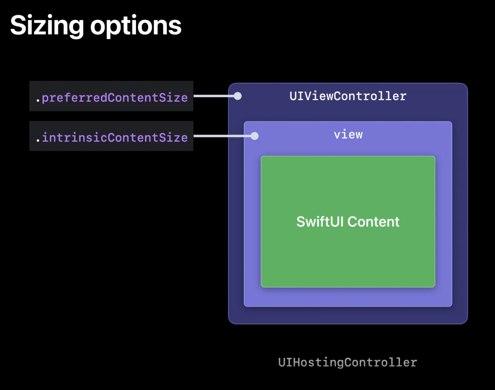

# Use SwiftUI With UIKit - WWDC22
In this demo project we will: 
- Demonstrate 3 methods to present a SwiftUI View on an existing UIKit project using UIViewControllers.
- How to bridge data between the legacy app and SwiftUI back and forth. 
- How to embed SwiftUI into UICollectionView and UITableView with UIHostingConfiguration.

References: 
- WWDC 2022 video: https://developer.apple.com/videos/play/wwdc2022/10072
- An article on www.avanderlee.com: https://www.avanderlee.com/swiftui/integrating-swiftui-with-uikit

## Video Demo
<p align="center">

</p>

# Table of contents
* UIHostingController
* Bridging data 
* SwiftUI in cells 
* Data flow for cells

## UIHostingController

- UIHostingController is a UIViewController that contains a SwiftUI view hierarchy. 
- We can use a hosting controller anywhere we can use a view controller in UIKit.
- Structure of UIHostingController: UIHostingController is a view controller, which means it has a UIView stored in its view property, and inside that view is where the SwiftUI content is rendered.

<p align="center">

</p>

### How to use UIHostingController

a. Presenting a UIHostingController as a modal view controller:

```swift
let swiftUIView = SwiftUIView()
let hostingController = UIHostingController(rootView: swiftUIView)

hostingController.modalTransitionStyle = .crossDissolve
hostingController.modalPresentationStyle = .popover

// Present the hosting controller modally
self.present(hostingController, animated: true, completion: nil)
```

For **modalTransitionsStyle**, we have options like `flipHorizontal`, `coverVertical`, `crossDissolve`, and `partialCurl`.

For **modalPresentationStyle**, we have options like `fullScreen`, `formSheet`, `popover`, `automatic`, `currentContext`, `custom`, `overCurrentContext`, `overFullScreen`, `pageSheet`, and `none`

**modalTransitionStyle** option as `partialCurl`must go with **modalPresentationStyle** as `.fullScreen` to demo the effect. Otherwise, we will receive an error similar to the following one from the compiler:

`Thread 1: "Application tried to present UIModalTransitionStylePartialCurl to or from non-fullscreen view controller <SwiftUIViewForUIKitProject.ViewController: 0x7fb429008eb0>."`

b. Present a hosting view controller as an embedded view onto the UIKit view

- Build the following custom function:

```swift
    /// Fully add SwiftUI `view` onto the UIKit `view`
    /// - Parameters:
    ///   - swiftUIView: The SwiftUI `view` to add as a child.
    ///   - view: The `UIView` instance to which the view should be added.
    func addSubSwiftUIView<Content>(_ swiftUIView: Content, to view: UIView) where Content: View {
        let hostingController = UIHostingController(rootView: swiftUIView)
        /// Add the hosting controller as a child view controller for the current view controller
        self.addChild(hostingController)
        
        /// add the SwiftUI view to the view controller view hierarchy
        self.view.addSubview(hostingController.view)
        
        /// Setup the constraints to update the SwiftUI view boundaries
        hostingController.view.translatesAutoresizingMaskIntoConstraints = false
        NSLayoutConstraint.activate([
            hostingController.view.topAnchor.constraint(equalTo: view.topAnchor),
            hostingController.view.leftAnchor.constraint(equalTo: view.leftAnchor),
            view.bottomAnchor.constraint(equalTo: hostingController.view.bottomAnchor),
            view.rightAnchor.constraint(equalTo: hostingController.view.rightAnchor)
        ])
        
        /// Notify the hosting controller that it has been moved to the current view controller
        hostingController.didMove(toParent: self)
    }
```
- Use the custom function above to present the hosting controller

```swift
let swiftUIVIew = SwiftUIView()
self.addSubSwiftUIView(swiftUIVIew, to: view)
```


- When the SwiftUI content inside UIHostingController changes, it may cause the view to need to be resized. In iOS 16.0, the UIHostingController enables automatic updates of the view controller's preferred content size and the view's intrinsic content size.

<p align="center">

</p>

We can enable this automatic update via using the new [**sizingOptions** property](https://developer.apple.com/documentation/swiftui/nshostingcontroller/sizingoptions) on UIHostingController.

```swift
let swiftUIView = SwiftUIView()
let hostingController = UIHostingController(rootView: swiftUIView)

hostingController.modalTransitionStyle = .crossDissolve
hostingController.modalPresentationStyle = .popover

/// Since `sizingOptions` API only available from iOS 16.0, we need a version check here 
if #available(iOS 16.0, *) {
	hostingController.sizingOptions = .preferredContentSize
} else {
	// Fallback on earlier versions
}
present(hostingController, animated: true, completion: nil)
```
Since SwiftUI is available from iOS 13.0 and if your app still supports older iOS versions, we should have a version check when adding the SwiftUI features into the codebase.

```swift
if #available(iOS 13.0, *) {
    presentSwiftUIView()
} else {
    // Fallback on earlier versions
}
```

## Bridging Data from App to SwiftUI

Data in SwiftUI views 

| Data owned <br/> by SwiftUI view | External data   |  External reference <br/> with change traking   |
| -------------------------------- | --------------  | ----------------------------------------------- |
| @State      						  | Passed arguments| @ObservableObject                               |
| @StateObject      				  |                 | @EnvironmentObject                              |


To update the views hosted inside UIHostingController, we have the following methods: 
a. Manually passing an argument in the UIHostingController
b. Using `ObservableObject` to pass data from SwiftUI to UIKit view

- Create a data class called `ContentViewData` and conform to `ObservableObject`, then create a variable called `name` and mark it as a `@Published` Property Wrapper.

```swift
class ContentViewData: ObservableObject {
    @Published var name: String = ""
}
```

- Create a new SwiftUI view, then create a property called `data` and mark it as `@ObservedObject` Property Wrapper. We will bind the `data` and `name` as in `self.$data.name`. At this point, whenever the user types in some text in `TextField()`, the text field will reflect the changes

```swift
struct BridgingDataSwiftUIView: View {
	@ObservedObject var data: ContentViewData
    
    var body: some View {
        VStack {
            TextField("Enter name", text: self.$data.name)
        }.background(Color.green)
    }
}

struct BridgingDataSwiftUIView_Previews: PreviewProvider {
    static var previews: some View {
        BridgingDataSwiftUIView(data: ContentViewData())
    }
}
```
- Back to the UIKit view, we will set up to receive data streams from the SwiftUI view:
	a. Create a UILabel on the UIKit view and add it to the stack view.
	
	```swift
private lazy var inputReceivedFromSwifUIView: UILabel = {
        let label = UILabel()
        label.text = ""
        label.backgroundColor = .cyan
        label.translatesAutoresizingMaskIntoConstraints = false
        return label
}()
```

	b. Create a new button to present the SwiftUI view with inputted data from the text field, then add this UI component inside the stack view as well.
	
	```swift
private lazy var buttonToPresentSwiftUIViewWithData: UIButton = {
        let button = UIButton(type: .system)
        button.backgroundColor = .yellow
        button.setTitle("Present SwiftUI View and \nsend data from SwiftUI view to UIKit view", for: .normal)
        button.setTitleColor(.black, for: .normal)
        button.layer.cornerRadius = 5.0
        button.titleLabel?.lineBreakMode = .byWordWrapping
        button.titleLabel?.textAlignment = .center
        button.translatesAutoresizingMaskIntoConstraints = false
        button.addTarget(self, action: #selector(presentSwiftUIViewWithData), for: .touchUpInside)
        return button
    }()
```
	c. Create a property called `cancellable` from the library **Combine** within `ViewController`. With this property, we use it to cancel the data stream of the SwiftUI view.
	
	```swift
	import Combine
	
	class ViewController: UIViewController {
	//...
	private var cancellable: AnyCancellable?
	//...
	}
	```
	
	d. Set up the `presentSwiftUIViewWithData` method to perform 2 tasks. Firstly, this method will present the `BridgingDataSwiftUIView` on the UIKit view via using `UIHostingController` connecting with the data layer from `ContentViewData`. Secondly, it receives inputted data from the SwiftUI view and binds those data to UILabel `inputReceivedFromSwifUIView` on the UIKit view.
	
	```swift
	@objc private func presentSwiftUIViewWithData() {
        let contentViewWithData = ContentViewData()
        let swiftUIViewWithData = BridgingDataSwiftUIView(data: contentViewWithData)
        let hostingController: UIHostingController<BridgingDataSwiftUIView>
        
        hostingController = UIHostingController(rootView: swiftUIViewWithData)
        
        hostingController.modalTransitionStyle = .flipHorizontal
        hostingController.modalPresentationStyle = .popover
        
        // Binding data from the SwiftUI view to the UILabel on the UIKit view
        // and stop the data stream if the user stops inputting text into the text field.
        self.cancellable = contentViewWithData.$name.sink { name in
            self.inputReceivedFromSwifUIView.text = name
        }
        
        self.present(hostingController, animated: true)
    }
    ```

	


 

